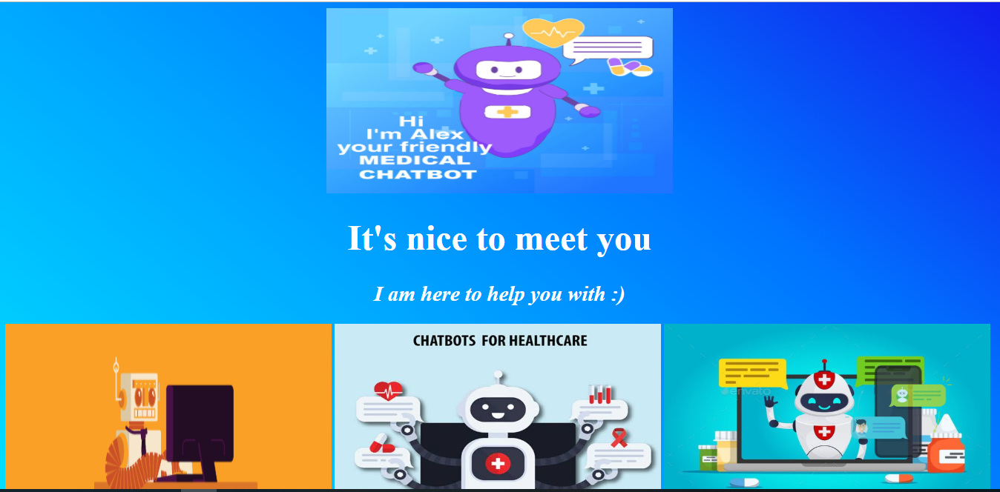
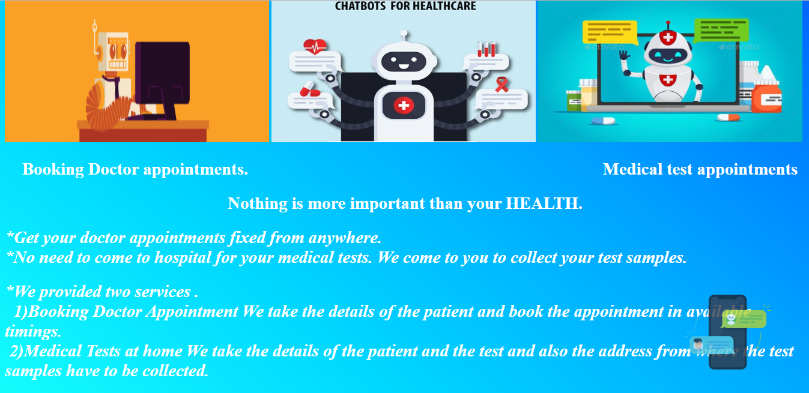
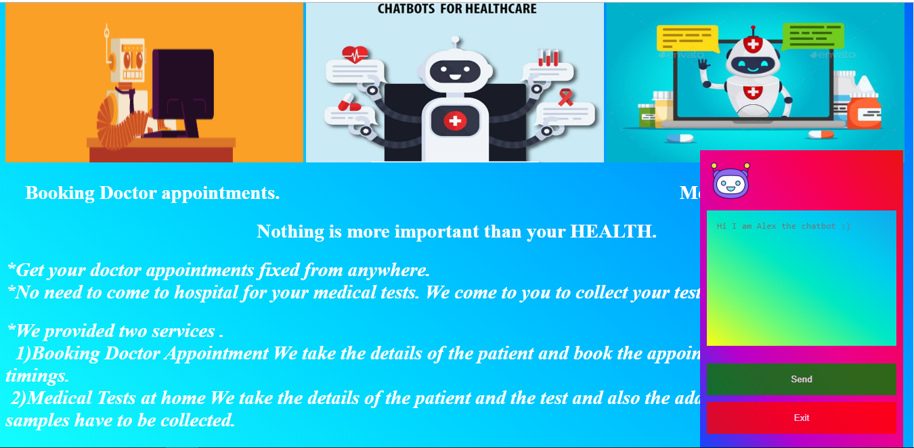

# frontend-of-the-chatbot

# Contributors
  1) M.Revanth - 19pa1a0598
  2) M.Sesha Sai Anjaneya - 19pa1a05a1

# Objective of the project
  :arrow_right: To create a frontend website to run our chatbot. 

  :arrow_right: To provide a beautiful environment for our chatbot. 

  :arrow_right: To provide information about our chatbot.

# Description of the project
  :arrow_right: We designed a good looking environment to run our chatbot. 

  :arrow_right: We explained about our chatbot using pictures and some information.
  
  :arrow_right:we provided for chatting using an pop-up model at end of the web page.
  
  :arrow_right:when we press the icon an backbround will pop-up for our conversation.
  
# Description of our chatbot
  We provided two services in our chatbot 

  :arrow_right: Booking Doctor Appointment 
   
   We take the details of the patient and book the appointment in available timings. 

  :arrow_right: Medical Tests at home 
   
   We take the details of the patient and the test and also the address from where the test samples have to be collected. 

# Languages used
  :arrow_right: HTMl
  
  :arrow_right: CSS
 
  :arrow_right: Javascript 
  
# Website pics
  
  
  
  
  
  
# Website link

  https://19pa1a0598.github.io/frontend-of-the-chatbot/
